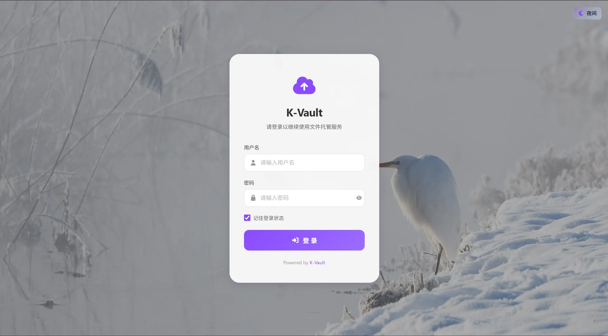
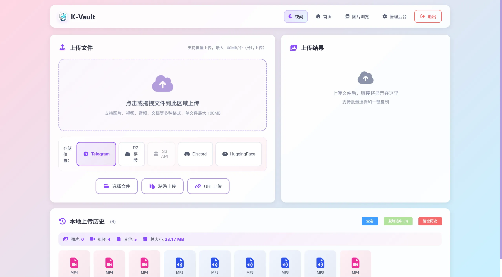
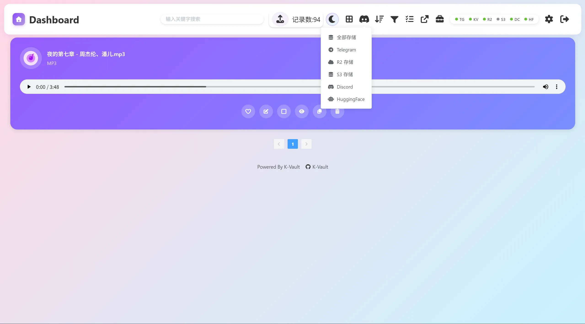
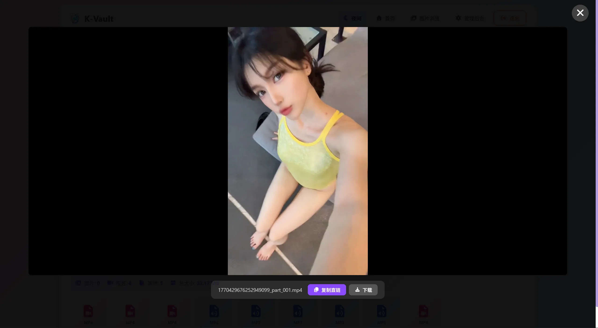

<div align="center">


# K-Vault

> Free image/file hosting solution based on Cloudflare Pages, with support for multiple storage backends.

**English** | [中文](README.md)

<br>


</div>

---

## Screenshots

<table>
  <tr>
    <td width="50%">
      
    </td>
    <td width="50%">
      
    </td>
  </tr>
  <tr>
    <td width="50%">
      
    </td>
    <td width="50%">
      
    </td>
  </tr>
</table>

## Features

- **Unlimited Storage** - Upload unlimited images and files
- **Completely Free** - Hosted on Cloudflare, zero cost within the free quota
- **Free Domain** - Uses `*.pages.dev` subdomain, and also supports custom domains
- **Multiple Storage Backends** - Supports Telegram, Cloudflare R2, S3-compatible storage, Discord, and HuggingFace
- **Telegram Webhook Backlink** - Bot can automatically reply with direct links after receiving files in channels/groups
- **KV Write Optimization** - Telegram can use signed direct links to significantly reduce KV read/write usage
- **Content Moderation** - Optional image moderation API to automatically block inappropriate content
- **Multi-format Support** - Images, videos, audio, documents, archives, and more
- **Online Preview** - Supports preview for images, videos, audio, and documents (pdf, docx, txt)
- **Chunked Upload** - Supports files up to 100MB (with R2/S3)
- **Guest Upload** - Optional guest upload with file size and daily upload limits
- **Multiple Views** - Grid, list, and waterfall management views
- **Storage Classification** - Clearly distinguishes files from different storage backends

---

## Quick Deployment

### Prerequisites

- Cloudflare account
- Telegram account (if using Telegram storage)

### Step 1: Get Telegram Credentials

1. **Get Bot Token**
   - Send `/newbot` to [@BotFather](https://t.me/BotFather)
   - Follow the prompts to create a bot and get `BOT_TOKEN`

2. **Create a Channel and Add the Bot**
   - Create a new Telegram channel
   - Add the bot as a channel administrator

3. **Get Chat ID**
   - Send a message to [@VersaToolsBot](https://t.me/VersaToolsBot) or [@GetTheirIDBot](https://t.me/GetTheirIDBot) to get the channel ID

### Step 2: Deploy to Cloudflare

1. **Fork this repository**

2. **Create a Pages project**
   - Log in to [Cloudflare Dashboard](https://dash.cloudflare.com)
   - Go to `Workers and Pages` → `Create Application` → `Pages` → `Connect to Git`
   - Select the forked repository and deploy

3. **Configure environment variables**
   - Go to project `Settings` → `Environment variables`
   - Add required variables:

| Variable | Description | Required |
| :--- | :--- | :---: |
| `TG_Bot_Token` | Telegram Bot Token | ✅ |
| `TG_Chat_ID` | Telegram channel ID | ✅ |
| `BASIC_USER` | Admin username | Optional |
| `BASIC_PASS` | Admin password | Optional |

**Redeploy** - Changes to environment variables require redeployment to take effect

---

## Storage Configuration

### Telegram Enhanced Mode (Self-hosted Bot API + Webhook)

This project supports switching the Telegram API base URL to a self-hosted Bot API and replying with direct links automatically via Webhook when files are received in groups/channels.

**Key environment variables:**

| Variable | Description | Example |
| :--- | :--- | :--- |
| `CUSTOM_BOT_API_URL` | Self-hosted Bot API URL (defaults to `https://api.telegram.org` if not set) | `http://127.0.0.1:8081` |
| `PUBLIC_BASE_URL` | Public domain used for Webhook backlink replies (recommended) | `https://img.example.com` |
| `TG_WEBHOOK_SECRET` | Webhook secret, verified by header `X-Telegram-Bot-Api-Secret-Token` | `your-secret` |
| `TELEGRAM_LINK_MODE` | Telegram link mode; set `signed` to enable signed direct links | `signed` |
| `MINIMIZE_KV_WRITES` | Set `true` to enable low-KV-write mode (also enables signed direct links) | `true` |
| `TELEGRAM_METADATA_MODE` | Telegram metadata write mode: `off` disables admin index writes; lightweight index is default | `off` |
| `TG_UPLOAD_NOTIFY` | Whether to send extra "direct link + File ID" notification after web upload succeeds | `true` |
| `FILE_URL_SECRET` | Signed direct-link secret (falls back to `TG_Bot_Token` if unset) | `random-long-secret` |

**Webhook deployment steps:**

1. Add the bot to the target channel/group on Telegram and grant permission to post (admin recommended for channels).
2. Set `TG_Bot_Token`, `PUBLIC_BASE_URL`, and `TG_WEBHOOK_SECRET` in Cloudflare Pages, then redeploy.
3. Call `setWebhook` and point to this project endpoint: `https://your-domain/api/telegram/webhook`.
4. Send images/files in the channel/group, and the bot will auto-reply with `/file/...` direct links.

**`setWebhook` example (official API):**

```bash
curl -X POST "https://api.telegram.org/bot<YOUR_BOT_TOKEN>/setWebhook" \
  -H "Content-Type: application/json" \
  -d "{\"url\":\"https://img.example.com/api/telegram/webhook\",\"secret_token\":\"<YOUR_SECRET>\",\"allowed_updates\":[\"message\",\"channel_post\"]}"
```

**`setWebhook` example (self-hosted Bot API):**

```bash
curl -X POST "http://127.0.0.1:8081/bot<YOUR_BOT_TOKEN>/setWebhook" \
  -H "Content-Type: application/json" \
  -d "{\"url\":\"https://img.example.com/api/telegram/webhook\",\"secret_token\":\"<YOUR_SECRET>\",\"allowed_updates\":[\"message\",\"channel_post\"]}"
```

> **About 2GB files:**  
> With a self-hosted Bot API (`CUSTOM_BOT_API_URL`), when files are sent directly from a Telegram client to a group/channel and returned via Webhook links, you can use the Bot API large-file capability (commonly up to 2GB).  
> But the web upload path is still constrained by current frontend strategy and Cloudflare request size limits (see "Usage Limits" below), so it is not equivalent to direct 2GB upload from the web UI.
>
> **Note:** Downloading files through a self-hosted Bot API first caches files on local disk. Reserve enough space and monitor I/O.

### Telegram Low-KV-Write Mode (Optional)

If you are concerned about Cloudflare KV daily quota usage, you can enable:

- `TELEGRAM_LINK_MODE=signed` (signed direct links for Telegram files only)
- Or `MINIMIZE_KV_WRITES=true` (also affects chunked upload task write strategy)

After enabling this, Telegram files still write a lightweight KV index by default (for admin list and management operations). Downloads resolve `file_id` through signed parameters, reducing KV read/write pressure.

> **Optional tradeoff:** If you want Telegram files to skip KV writes entirely, also set `TELEGRAM_METADATA_MODE=off`. In this mode, files will not appear in the admin list, and tag/allowlist/denylist/delete flows that rely on KV metadata will be unavailable.

### KV Storage (Required for Image Management)

To enable image management, configure KV:

1. Go to Cloudflare Dashboard → `Workers and Pages` → `KV`
2. Click `Create namespace`, name it `k-vault`
3. Go to your Pages project → `Settings` → `Functions` → `KV namespace bindings`
4. Add binding: variable name `img_url`, choose the namespace you created
5. Redeploy the project

### R2 Storage (Large File Support, Optional)

Configure R2 to support uploads up to 100MB:

1. **Create a bucket**
   - Cloudflare Dashboard → `R2 Object Storage` → `Create bucket`
   - Name it `k-vault-files`

2. **Bind to the project**
   - Pages project → `Settings` → `Functions` → `R2 bucket bindings`
   - Variable name `R2_BUCKET`, choose your bucket

3. **Enable R2**
   - `Settings` → `Environment variables` → add `USE_R2` = `true`
   - Redeploy

### S3-Compatible Storage (Optional)

Supports any S3-compatible object storage service, including AWS S3, MinIO, BackBlaze B2, Alibaba Cloud OSS, etc.

**Environment variables:**

| Variable | Description | Example |
| :--- | :--- | :--- |
| `S3_ENDPOINT` | S3 service endpoint URL | `https://s3.us-east-1.amazonaws.com` |
| `S3_REGION` | Region | `us-east-1` |
| `S3_ACCESS_KEY_ID` | Access Key ID | `AKIA...` |
| `S3_SECRET_ACCESS_KEY` | Secret Access Key | `wJalr...` |
| `S3_BUCKET` | Bucket name | `my-filebed` |

**Endpoint examples by provider:**

| Provider | Endpoint format | Region |
| :--- | :--- | :--- |
| AWS S3 | `https://s3.{region}.amazonaws.com` | `us-east-1` etc. |
| MinIO | `https://minio.example.com:9000` | `us-east-1` |
| BackBlaze B2 | `https://s3.{region}.backblazeb2.com` | `us-west-004` etc. |
| Alibaba Cloud OSS | `https://oss-{region}.aliyuncs.com` | `cn-hangzhou` etc. |
| Cloudflare R2 | `https://{account_id}.r2.cloudflarestorage.com` | `auto` |

**Deployment steps:**

1. Create a bucket in your S3 provider
2. Get Access Key ID and Secret Access Key
3. Add the environment variables above in your Cloudflare Pages project
4. Redeploy, and the frontend will automatically show S3 storage options

### Discord Storage (Optional)

Store files through a Discord channel, supporting both Webhook and Bot modes.

> **Note:** Discord attachment URLs expire after about 24 hours. This project provides downloads through a proxy and refreshes URLs automatically per request. The current version prioritizes Bot message lookup and falls back to Webhook lookup on failure. If both Bot and Webhook are configured, ensure the Bot has read access to the Webhook channel.

**Environment variables:**

| Variable | Description | Required |
| :--- | :--- | :---: |
| `DISCORD_WEBHOOK_URL` | Discord Webhook URL (recommended for uploads) | One of two |
| `DISCORD_BOT_TOKEN` | Discord Bot Token (for fetching and deleting files) | Recommended |
| `DISCORD_CHANNEL_ID` | Discord channel ID (required for Bot-mode upload) | Bot mode |

**Webhook deployment (recommended):**

1. In your Discord server, go to channel settings → Integrations → Webhooks
2. Create a new Webhook and copy the Webhook URL
3. Add environment variable `DISCORD_WEBHOOK_URL` in Cloudflare Pages
4. (Recommended) Also create a Discord Bot and set `DISCORD_BOT_TOKEN` for file retrieval and deletion
5. Redeploy

**Bot deployment:**

1. Go to [Discord Developer Portal](https://discord.com/developers/applications) and create an application
2. Create a Bot in the Bot tab and get the token
3. In OAuth2 → URL Generator, select `bot` scope and grant `Administrator` permission to the Bot
4. Use the generated URL to invite the Bot to your server
5. Add `DISCORD_BOT_TOKEN` and `DISCORD_CHANNEL_ID` in Cloudflare Pages
6. Redeploy

**Troubleshooting (`File not found on Discord`):**

1. Ensure the channel pointed to by `DISCORD_WEBHOOK_URL` is also accessible by the Bot (channel mismatch can cause upload success but direct link failure).
2. Grant the Bot `Administrator` permission directly to avoid read failures from missing channel permissions.
3. You must redeploy Cloudflare Pages after changing environment variables (saving variables alone does not apply immediately).
4. Open `/api/status` and check whether Discord status is `bot`, `webhook`, or `bot+webhook`.

**Limits:**
- Non-Boosted server: 25MB/file
- Level 2 Boost: 50MB/file
- Level 3 Boost: 100MB/file

### HuggingFace Storage (Optional)

Use HuggingFace Datasets API to store files. Files are saved to a Dataset repository as git commits.

**Environment variables:**

| Variable | Description | Example |
| :--- | :--- | :--- |
| `HF_TOKEN` | HuggingFace token with write access | `hf_xxxxxxxxxxxx` |
| `HF_REPO` | Dataset repository ID | `username/my-filebed` |

**Deployment steps:**

1. Register a [HuggingFace](https://huggingface.co) account
2. Create a new Dataset repository (Settings → New Dataset)
3. Go to [Settings → Access Tokens](https://huggingface.co/settings/tokens) and create a token (requires Write permission)
4. Add `HF_TOKEN` and `HF_REPO` environment variables in Cloudflare Pages
5. Redeploy

**Limits:**
- Regular upload (base64): about 35MB/file
- LFS upload: up to 50GB/file
- Total free-tier repository size: about 50GB

---

## Guest Upload Feature

Allows non-logged-in users to upload files. Site owners can configure whether it is enabled and apply restriction rules.

| Variable | Description | Default |
| :--- | :--- | :--- |
| `GUEST_UPLOAD` | Enable guest upload | `false` |
| `GUEST_MAX_FILE_SIZE` | Max guest single-file size (bytes) | `5242880` (5MB) |
| `GUEST_DAILY_LIMIT` | Guest daily upload limit (by IP) | `10` |

**How to enable:**

1. Set `GUEST_UPLOAD` = `true` in environment variables
2. Adjust `GUEST_MAX_FILE_SIZE` and `GUEST_DAILY_LIMIT` as needed
3. Ensure `BASIC_USER` and `BASIC_PASS` are configured (otherwise guest/admin cannot be distinguished)
4. Redeploy

**Feature behavior:**
- Guests can upload directly from the homepage without login
- Guest uploads are limited by single-file size and daily count
- Guests cannot use chunked uploads or advanced storage options (S3/Discord/HuggingFace)
- Guests cannot access the admin panel or gallery page
- Limits are based on guest IP address and reset daily

---

## Advanced Configuration

| Variable | Description | Default |
| :--- | :--- | :--- |
| `ModerateContentApiKey` | Image moderation API key (from [moderatecontent.com](https://moderatecontent.com)) | - |
| `WhiteList_Mode` | Whitelist mode, only whitelisted images can be loaded | `false` |
| `USE_R2` | Enable R2 storage | `false` |
| `CUSTOM_BOT_API_URL` | Telegram API base URL (supports self-hosted Bot API) | `https://api.telegram.org` |
| `PUBLIC_BASE_URL` | Public domain used for Webhook backlinks | Current request domain |
| `TG_WEBHOOK_SECRET` | Telegram Webhook secret (also compatible with `TELEGRAM_WEBHOOK_SECRET`) | - |
| `TELEGRAM_LINK_MODE` | Telegram link mode (`signed` for signed direct links) | - |
| `MINIMIZE_KV_WRITES` | Reduce KV writes (also enables signed direct links) | `false` |
| `TELEGRAM_METADATA_MODE` | Telegram metadata write mode (`off` disables admin index writes) | `on` |
| `TG_UPLOAD_NOTIFY` | Send "direct link + File ID" notification after web upload succeeds | `true` |
| `FILE_URL_SECRET` | Signed direct-link secret (also compatible with `TG_FILE_URL_SECRET`) | `TG_Bot_Token` |
| `CHUNK_BACKEND` | Chunk temporary storage backend (`auto`/`r2`/`kv`) | `auto` |
| `disable_telemetry` | Disable telemetry | - |

---

## Pages

| Page | Path | Description |
| :--- | :--- | :--- |
| Home/Upload | `/` | Batch upload, drag-and-drop, paste upload |
| Gallery | `/gallery.html` | Image grid browsing |
| Admin Panel | `/admin.html` | File management, blacklist/whitelist |
| File Preview | `/preview.html` | Multi-format file preview |
| Login Page | `/login.html` | Admin login |

---

## Usage Limits

**Cloudflare free quota:**

- 100,000 requests/day
- KV: 1,000 writes/day, 100,000 reads/day, 1,000 list operations/day
- Upgrade to a paid plan if exceeded (starting from $5/month)
- For Telegram-heavy scenarios, signed direct links or low-KV-write mode are recommended to reduce quota pressure

**File size limits by storage backend:**

| Storage backend | Max single-file size |
| :--- | :--- |
| Telegram (web direct upload) | Small-file direct upload 20MB; current chunked flow limit 100MB |
| Telegram (self-hosted Bot API + Telegram client + Webhook) | Depends on Bot API and deployment environment, commonly up to 2GB |
| Cloudflare R2 | 100MB (chunked upload) |
| S3-compatible storage | 100MB (chunked upload) |
| Discord (non-Boosted) | 25MB |
| Discord (Level 2+) | 50-100MB |
| HuggingFace | 35MB (regular) / 50GB (LFS) |

> Note: `/api/upload-from-url` currently still applies a 20MB limit for Telegram uploads.

---

## Full Environment Variable Reference

| Variable | Description | Required |
| :--- | :--- | :---: |
| `TG_Bot_Token` | Telegram Bot Token | ✅ |
| `TG_Chat_ID` | Telegram channel ID | ✅ |
| `CUSTOM_BOT_API_URL` | Self-hosted Telegram Bot API URL | Optional |
| `PUBLIC_BASE_URL` | Webhook backlink domain | Optional |
| `TG_WEBHOOK_SECRET` | Telegram Webhook secret | Optional |
| `TELEGRAM_WEBHOOK_SECRET` | Same as above (compatible variable name) | Optional |
| `TELEGRAM_LINK_MODE` | Telegram link mode (`signed`) | Optional |
| `MINIMIZE_KV_WRITES` | Reduce KV writes and enable signed direct links | Optional |
| `TELEGRAM_METADATA_MODE` | Telegram metadata write mode (`off` disables admin index writes) | Optional |
| `TG_UPLOAD_NOTIFY` | Send "direct link + File ID" notification after web upload succeeds | Optional |
| `FILE_URL_SECRET` | Signed direct-link secret | Optional |
| `TG_FILE_URL_SECRET` | Same as above (compatible variable name) | Optional |
| `BASIC_USER` | Admin username | Optional |
| `BASIC_PASS` | Admin password | Optional |
| `USE_R2` | Enable R2 storage | Optional |
| `CHUNK_BACKEND` | Chunk temporary storage backend (`auto`/`r2`/`kv`) | Optional |
| `S3_ENDPOINT` | S3 endpoint URL | Optional |
| `S3_REGION` | S3 region | Optional |
| `S3_ACCESS_KEY_ID` | S3 access key | Optional |
| `S3_SECRET_ACCESS_KEY` | S3 secret key | Optional |
| `S3_BUCKET` | S3 bucket name | Optional |
| `DISCORD_WEBHOOK_URL` | Discord Webhook URL | Optional |
| `DISCORD_BOT_TOKEN` | Discord Bot Token | Optional |
| `DISCORD_CHANNEL_ID` | Discord channel ID | Optional |
| `HF_TOKEN` | HuggingFace token | Optional |
| `HF_REPO` | HuggingFace repository ID | Optional |
| `GUEST_UPLOAD` | Enable guest upload | Optional |
| `GUEST_MAX_FILE_SIZE` | Guest file size limit (bytes) | Optional |
| `GUEST_DAILY_LIMIT` | Guest daily upload count | Optional |
| `ModerateContentApiKey` | Image moderation API key | Optional |
| `WhiteList_Mode` | Whitelist mode | Optional |
| `disable_telemetry` | Disable telemetry | Optional |

---

## Related Links

- [Cloudflare Pages Documentation](https://developers.cloudflare.com/pages/)
- [Telegram Bot API](https://core.telegram.org/bots/api)
- [Telegram Bot API Server (Self-hosted)](https://github.com/tdlib/telegram-bot-api)
- [Issue Tracker](https://github.com/katelya77/K-Vault/issues)

---

## Acknowledgements

This project references the following open-source project:

- [Telegraph-Image](https://github.com/cf-pages/Telegraph-Image) - Original inspiration

---

## License

MIT License

---

## Star History

[](https://star-history.com/#katelya77/K-Vault&Date)
